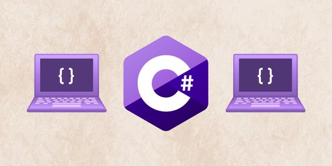

  # Изучение C#

Этот репозиторий используется для сохранения проектов в ходе обучения на курсах в колледже. Здесь представлены задачи, выполненные в ходе обучения, позволяя отслеживать прогресс и развитие навыков программирования в языке C#.

**Примечание:** Этот репозиторий фокусируется на задачах, решенных в ходе обучения в колледже и может не представлять интереса для широкой аудитории.

